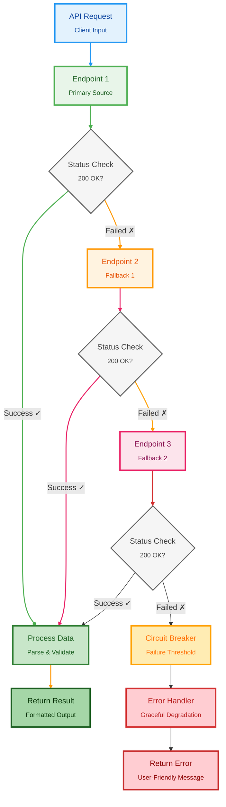

# 🌐 API Utilities & Helpers Guide

Complete guide for using API utilities, helpers, and external integrations in Liora.

---

## 📋 Table of Contents

- [API Fallback System](#api-fallback-system)
- [Built-in API Utilities](#built-in-api-utilities)
- [Creating Custom APIs](#creating-custom-apis)
- [Best Practices](#best-practices)

---

## 🔄 API Fallback System

Liora uses a robust fallback system that tries multiple API endpoints until one succeeds.

### How Fallback Works



### Example: Image Enhancement

```javascript
/**
 * @file Image enhancement with fallback
 * @module lib/api/remini
 */

import { uploader } from "#lib/uploader.js";

export async function remini(buf) {
    // Upload image first
    const up = await uploader(buf).catch(() => null);
    if (!up || !up.url) {
        return { success: false, error: "Upload failed" };
    }

    const enc = encodeURIComponent(up.url);

    // Multiple API endpoints (fallback list)
    const urls = [
        `https://api.example1.com/upscale?url=${enc}`,
        `https://api.example2.com/enhance?url=${enc}`,
        `https://api.example3.com/upscale?url=${enc}&scale=2`,
        `https://api.example4.com/upscale?url=${enc}&scale=4`,
        `https://api.example5.com/tools/upscale?image=${enc}`,
    ];

    // Try each endpoint
    for (const url of urls) {
        const res = await fetch(url).catch(() => null);
        if (!res) continue;

        const type = res.headers.get("content-type") || "";

        // Handle JSON response
        if (type.includes("application/json")) {
            const json = await res.json().catch(() => null);

            if (json?.result) {
                return { success: true, resultUrl: json.result };
            }
            if (json?.data?.url) {
                return { success: true, resultUrl: json.data.url };
            }
        }

        // Handle direct image response
        if (type.includes("image")) {
            const chunks = [];
            const reader = res.body.getReader();

            while (true) {
                const { done, value } = await reader.read();
                if (done) break;
                chunks.push(value);
            }

            reader.releaseLock();

            const total = chunks.reduce((acc, chunk) => acc + chunk.length, 0);
            const combined = new Uint8Array(total);
            let offset = 0;

            for (const chunk of chunks) {
                combined.set(chunk, offset);
                offset += chunk.length;
            }

            const buf = Buffer.from(combined.buffer);
            if (buf.length) {
                return { success: true, resultBuffer: buf };
            }
        }
    }

    return { success: false, error: "All endpoints failed" };
}
```

---

## 🛠️ Built-in API Utilities

### 1. Image Uploader

Uploads images to temporary hosting services.

```javascript
import { uploader } from "#lib/uploader.js";

// Upload buffer
const result = await uploader(imageBuffer);

console.log(result);
// {
//   success: true,
//   url: "https://example.com/image.jpg"
// }
```

**Usage in Plugin:**

```javascript
let handler = async (m, { sock }) => {
    const q = m.quoted ? m.quoted : m;
    const media = await q.download();

    if (!media) {
        return m.reply("Example: No media found");
    }

    const uploaded = await uploader(media);

    if (!uploaded || !uploaded.url) {
        return m.reply("Example: Upload failed");
    }

    await sock.sendMessage(m.chat, {
        text: `Example: Image uploaded to ${uploaded.url}`,
    });
};
```

### 2. Image Enhancement (Remini)

Enhances image quality using AI upscaling.

```javascript
import { remini } from "#lib/api/remini.js";

// Enhance image
const result = await remini(imageBuffer);

if (result.success) {
    if (result.resultUrl) {
        console.log("Enhanced image URL:", result.resultUrl);
    }
    if (result.resultBuffer) {
        console.log("Enhanced image buffer:", result.resultBuffer.length);
    }
} else {
    console.error("Enhancement failed:", result.error);
}
```

**Usage in Plugin:**

```javascript
let handler = async (m, { sock }) => {
    const q = m.quoted ? m.quoted : m;
    const media = await q.download();

    if (!media) {
        return m.reply("Example: Quote an image");
    }

    const loading = await sock.sendMessage(m.chat, {
        text: "⏳ Example: Enhancing image...",
    });

    const result = await remini(media);

    if (!result.success) {
        return sock.sendMessage(m.chat, {
            text: `❌ Example: ${result.error}`,
            edit: loading.key,
        });
    }

    await sock.sendMessage(m.chat, {
        image: result.resultBuffer || { url: result.resultUrl },
        caption: "✅ Example: Image enhanced",
    });
};

handler.help = ["enhance"];
handler.tags = ["tool"];
handler.command = /^(enhance|remini)$/i;

export default handler;
```

### 3. Background Remover

Removes background from images.

```javascript
import { removebg } from "#lib/api/removebg.js";

// Remove background
const result = await removebg(imageBuffer);

if (result.success) {
    console.log("Result:", result.resultUrl);
}
```

### 4. Social Media Downloaders

#### Instagram Downloader

```javascript
import { instagram } from "#lib/api/instagram.js";

const result = await instagram("https://instagram.com/p/example");

if (result.success) {
    console.log("Media URL:", result.url);
    console.log("Type:", result.type); // video or image
}
```

#### TikTok Downloader

```javascript
import { tiktok } from "#lib/api/tiktok.js";

const result = await tiktok("https://tiktok.com/@user/video/123");

if (result.success) {
    console.log("Video URL:", result.url);
    console.log("No watermark:", result.noWatermark);
}
```

#### YouTube Downloader

```javascript
import { ytmp3, ytmp4 } from "#lib/api/ytmp3.js";

// Audio download
const audio = await ytmp3("https://youtube.com/watch?v=example");
console.log("Audio URL:", audio.url);

// Video download
const video = await ytmp4("https://youtube.com/watch?v=example", "720p");
console.log("Video URL:", video.url);
```

#### Twitter/X Downloader

```javascript
import { twitter } from "#lib/api/twitter.js";

const result = await twitter("https://twitter.com/user/status/123");

if (result.success) {
    console.log("Media URLs:", result.media);
}
```

#### Threads Downloader

```javascript
import { threads } from "#lib/api/threads.js";

const result = await threads("https://threads.net/@user/post/123");

if (result.success) {
    console.log("Media:", result.media);
}
```

### 5. Spotify Integration

```javascript
import { spotify } from "#lib/api/spotify.js";

// Search tracks
const search = await spotify.search("Example Song Name");
console.log("Results:", search.tracks);

// Get track info
const track = await spotify.track("spotify:track:example123");
console.log("Track:", track);

// Download track
import { spotifydl } from "#lib/api/spotifydl.js";
const download = await spotifydl("https://open.spotify.com/track/example");
console.log("Download URL:", download.url);
```

---

## 🔧 Creating Custom APIs

### Basic API Wrapper

```javascript
/**
 * @file Custom API wrapper
 * @module lib/api/custom
 */

/**
 * Fetches data from custom API with fallback
 * @param {string} query - Search query
 * @returns {Promise<Object>} Result object
 */
export async function customAPI(query) {
    const endpoints = [
        `https://api.example1.com/search?q=${encodeURIComponent(query)}`,
        `https://api.example2.com/api?query=${encodeURIComponent(query)}`,
        `https://api.example3.com/v1/search?text=${encodeURIComponent(query)}`,
    ];

    for (const url of endpoints) {
        try {
            const response = await fetch(url, {
                headers: {
                    "User-Agent": "Liora-Bot/1.0",
                },
            });

            if (!response.ok) continue;

            const data = await response.json();

            // Validate response
            if (!data || !data.results) continue;

            // Return normalized data
            return {
                success: true,
                results: data.results,
                source: url,
            };
        } catch (error) {
            console.error(`API error (${url}):`, error);
            continue;
        }
    }

    return {
        success: false,
        error: "All API endpoints failed",
    };
}
```

### API with Authentication

```javascript
/**
 * @file Authenticated API wrapper
 * @module lib/api/authenticated
 */

/**
 * API with token authentication
 * @param {string} endpoint - API endpoint
 * @param {Object} options - Request options
 * @returns {Promise<Object>} Response data
 */
export async function authenticatedAPI(endpoint, options = {}) {
    const baseURL = "https://api.example.com";
    const apiKey = Bun.env.API_KEY;

    try {
        const response = await fetch(`${baseURL}${endpoint}`, {
            method: options.method || "GET",
            headers: {
                Authorization: `Bearer ${apiKey}`,
                "Content-Type": "application/json",
                ...options.headers,
            },
            body: options.body ? JSON.stringify(options.body) : undefined,
        });

        if (!response.ok) {
            throw new Error(`HTTP ${response.status}: ${response.statusText}`);
        }

        return await response.json();
    } catch (error) {
        console.error("API Error:", error);
        return { success: false, error: error.message };
    }
}
```

### API with Rate Limiting

```javascript
/**
 * @file Rate-limited API wrapper
 * @module lib/api/ratelimited
 */

const rateLimits = new Map();

/**
 * API with built-in rate limiting
 * @param {string} url - API URL
 * @param {number} maxRequests - Max requests per minute
 * @returns {Promise<Object>} Response data
 */
export async function rateLimitedAPI(url, maxRequests = 60) {
    const now = Date.now();
    const key = new URL(url).hostname;

    if (!rateLimits.has(key)) {
        rateLimits.set(key, { requests: [], resetAt: now + 60000 });
    }

    const limit = rateLimits.get(key);

    // Reset if time window passed
    if (now >= limit.resetAt) {
        limit.requests = [];
        limit.resetAt = now + 60000;
    }

    // Check rate limit
    if (limit.requests.length >= maxRequests) {
        const waitTime = limit.resetAt - now;
        throw new Error(`Rate limited. Try again in ${Math.ceil(waitTime / 1000)}s`);
    }

    limit.requests.push(now);

    try {
        const response = await fetch(url);
        return await response.json();
    } catch (error) {
        throw new Error(`API request failed: ${error.message}`);
    }
}
```

### API with Caching

```javascript
/**
 * @file Cached API wrapper
 * @module lib/api/cached
 */

const cache = new Map();

/**
 * API with response caching
 * @param {string} url - API URL
 * @param {number} ttl - Cache TTL in milliseconds
 * @returns {Promise<Object>} Response data
 */
export async function cachedAPI(url, ttl = 300000) {
    const now = Date.now();

    // Check cache
    if (cache.has(url)) {
        const { data, expiresAt } = cache.get(url);
        if (now < expiresAt) {
            console.log("Cache hit:", url);
            return data;
        }
        cache.delete(url);
    }

    // Fetch fresh data
    try {
        const response = await fetch(url);
        const data = await response.json();

        // Store in cache
        cache.set(url, {
            data,
            expiresAt: now + ttl,
        });

        console.log("Cache miss:", url);
        return data;
    } catch (error) {
        throw new Error(`API request failed: ${error.message}`);
    }
}
```

---

## ✅ Best Practices

### 1. Error Handling

```javascript
export async function safeAPI(url) {
    try {
        const response = await fetch(url);

        if (!response.ok) {
            return {
                success: false,
                error: `HTTP ${response.status}`,
                statusCode: response.status,
            };
        }

        const data = await response.json();

        return {
            success: true,
            data,
        };
    } catch (error) {
        return {
            success: false,
            error: error.message,
        };
    }
}
```

### 2. Timeout Handling

```javascript
export async function apiWithTimeout(url, timeout = 10000) {
    const controller = new AbortController();
    const timeoutId = setTimeout(() => controller.abort(), timeout);

    try {
        const response = await fetch(url, {
            signal: controller.signal,
        });

        clearTimeout(timeoutId);
        return await response.json();
    } catch (error) {
        clearTimeout(timeoutId);
        if (error.name === "AbortError") {
            throw new Error("Request timeout");
        }
        throw error;
    }
}
```

### 3. Retry Logic

```javascript
export async function retryAPI(url, maxRetries = 3) {
    for (let i = 0; i < maxRetries; i++) {
        try {
            const response = await fetch(url);
            if (response.ok) {
                return await response.json();
            }

            if (i === maxRetries - 1) {
                throw new Error(`Failed after ${maxRetries} retries`);
            }

            // Exponential backoff
            await new Promise((resolve) => setTimeout(resolve, Math.pow(2, i) * 1000));
        } catch (error) {
            if (i === maxRetries - 1) throw error;
        }
    }
}
```

### 4. Response Validation

```javascript
export async function validatedAPI(url, validator) {
    try {
        const response = await fetch(url);
        const data = await response.json();

        // Validate structure
        if (!validator(data)) {
            throw new Error("Invalid response structure");
        }

        return { success: true, data };
    } catch (error) {
        return { success: false, error: error.message };
    }
}

// Usage
const result = await validatedAPI("https://api.example.com/data", (data) => {
    return data && typeof data.id === "string" && Array.isArray(data.items);
});
```

### 5. Comprehensive API Module

```javascript
/**
 * @file Complete API utility
 * @module lib/api/complete
 */

export class APIClient {
    constructor(config = {}) {
        this.baseURL = config.baseURL;
        this.timeout = config.timeout || 10000;
        this.maxRetries = config.maxRetries || 3;
        this.cache = new Map();
        this.rateLimits = new Map();
    }

    async request(endpoint, options = {}) {
        const url = `${this.baseURL}${endpoint}`;

        // Check rate limit
        this.checkRateLimit(url);

        // Check cache
        if (options.cache) {
            const cached = this.getCache(url);
            if (cached) return cached;
        }

        // Make request with retry
        for (let i = 0; i < this.maxRetries; i++) {
            try {
                const response = await this.fetchWithTimeout(url, options);
                const data = await response.json();

                // Cache response
                if (options.cache) {
                    this.setCache(url, data, options.cacheTTL);
                }

                return { success: true, data };
            } catch (error) {
                if (i === this.maxRetries - 1) {
                    return { success: false, error: error.message };
                }
                await this.delay(Math.pow(2, i) * 1000);
            }
        }
    }

    async fetchWithTimeout(url, options) {
        const controller = new AbortController();
        const timeout = setTimeout(() => controller.abort(), this.timeout);

        try {
            const response = await fetch(url, {
                ...options,
                signal: controller.signal,
            });
            clearTimeout(timeout);
            return response;
        } catch (error) {
            clearTimeout(timeout);
            throw error;
        }
    }

    checkRateLimit(url) {
        const host = new URL(url).hostname;
        // Implementation...
    }

    getCache(key) {
        const cached = this.cache.get(key);
        if (cached && Date.now() < cached.expiresAt) {
            return cached.data;
        }
        return null;
    }

    setCache(key, data, ttl = 300000) {
        this.cache.set(key, {
            data,
            expiresAt: Date.now() + ttl,
        });
    }

    delay(ms) {
        return new Promise((resolve) => setTimeout(resolve, ms));
    }
}
```

---

## 📞 Need Help?

- **WhatsApp Group**: [Join Community](https://chat.whatsapp.com/FtMSX1EsGHTJeynu8QmjpG)
- **GitHub Issues**: [Report Bug](https://github.com/naruyaizumi/liora/issues)
