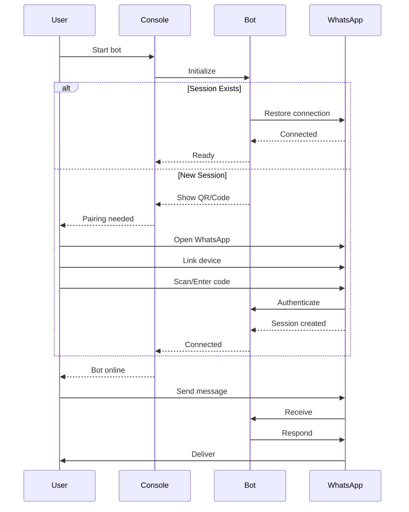

# 📦 Liora Installation Guide

Complete installation guide for setting up Liora WhatsApp bot on various platforms.

---

## 📋 Table of Contents

- [System Requirements](#system-requirements)
- [Automated Installation](#automated-installation)
- [Manual Installation](#manual-installation)
- [Platform-Specific Guides](#platform-specific-guides)
- [Post-Installation](#post-installation)
- [Troubleshooting](#troubleshooting)

---

## 💻 System Requirements

### Minimum Requirements

```
OS       : Linux (Ubuntu 20.04+, Debian 11+) / macOS / Windows (WSL2)
RAM      : 512 MB
Storage  : 1 GB free space
Runtime  : Bun >= 1.3.0
```

### Recommended Requirements

```
OS       : Ubuntu 22.04 LTS / Debian 12
RAM      : 1 GB+
Storage  : 2 GB+ free space
Runtime  : Latest Bun version
Network  : Stable internet connection
```

### Supported Platforms

✅ **Linux** (Ubuntu, Debian, Fedora, Arch)  
✅ **macOS** (Intel & Apple Silicon)  
✅ **Windows** (via WSL2)  
✅ **VPS/Cloud** (DigitalOcean, AWS, Azure, etc.)  
✅ **Pterodactyl Panel**  
✅ **Docker/Podman**

---

## 🚀 Automated Installation

### For Linux (Ubuntu/Debian)

The automated installer handles everything for you:

```bash
curl -fsSL https://raw.githubusercontent.com/naruyaizumi/liora/main/install.sh | bash
```

**What it does:**

```mermaid
graph TD
    A[Start Installation<br/><sub>Initial Setup</sub>]

    A --> B[System Check<br/><sub>OS & Requirements</sub>]
    B --> C{System Supported?<br/><sub>OS Validation</sub>}

    C -->|Yes ✓| D[Install Bun Runtime<br/><sub>JavaScript Runtime</sub>]
    C -->|No ✗| E[Error: Unsupported OS<br/><sub>Terminate Process</sub>]

    D --> F[Clone Repository<br/><sub>Git Clone</sub>]
    F --> G[Install Dependencies<br/><sub>Package Installation</sub>]
    G --> H[Configure Environment<br/><sub>Environment Variables</sub>]

    H --> I{Configuration Valid?<br/><sub>Validation Check</sub>}
    I -->|Yes ✓| J[Setup System Service<br/><sub>Service Creation</sub>]
    I -->|No ✗| K[Fix Configuration<br/><sub>Manual Correction</sub>]

    J --> L[Verify Installation<br/><sub>Health Check</sub>]
    L --> M{Dependencies OK?<br/><sub>Integrity Check</sub>}

    M -->|Yes ✓| N[Start Application<br/><sub>Launch Service</sub>]
    M -->|No ✗| O[Reinstall Dependencies<br/><sub>Clean Install</sub>]

    N --> P[Health Check<br/><sub>Service Monitoring</sub>]
    P --> Q{Service Running?<br/><sub>Status Verification</sub>}

    Q -->|Yes ✓| R[Installation Complete ✓<br/><sub>Success State</sub>]
    Q -->|No ✗| S[Troubleshoot Service<br/><sub>Debug Process</sub>]

    O --> G
    K --> H
    S --> J
    E --> R

    style A fill:#e3f2fd,stroke:#2196f3,stroke-width:3px,color:#0d47a1
    style B fill:#f5f5f5,stroke:#616161,stroke-width:2px,color:#424242
    style D fill:#fff3e0,stroke:#ff9800,stroke-width:3px,color:#e65100
    style F fill:#e8f5e9,stroke:#4caf50,stroke-width:3px,color:#1b5e20
    style G fill:#e8eaf6,stroke:#3f51b5,stroke-width:3px,color:#1a237e
    style H fill:#f3e5f5,stroke:#9c27b0,stroke-width:3px,color:#4a148c
    style J fill:#e0f2f1,stroke:#00695c,stroke-width:3px,color:#004d40
    style L fill:#fff8e1,stroke:#ff8f00,stroke-width:3px,color:#ff6f00
    style N fill:#e8f5e9,stroke:#2e7d32,stroke-width:3px,color:#1b5e20
    style R fill:#c8e6c9,stroke:#2e7d32,stroke-width:3px,color:#1b5e20

    style E fill:#ffcdd2,stroke:#d32f2f,stroke-width:3px,color:#b71c1c
    style O fill:#ffecb3,stroke:#ffa000,stroke-width:3px,color:#ff6f00
    style S fill:#ffecb3,stroke:#ffa000,stroke-width:3px,color:#ff6f00

    style C fill:#f5f5f5,stroke:#616161,stroke-width:2px,color:#424242
    style I fill:#f5f5f5,stroke:#616161,stroke-width:2px,color:#424242
    style M fill:#f5f5f5,stroke:#616161,stroke-width:2px,color:#424242
    style Q fill:#f5f5f5,stroke:#616161,stroke-width:2px,color:#424242

    linkStyle 0 stroke:#2196f3,stroke-width:2px
    linkStyle 1 stroke:#616161,stroke-width:2px
    linkStyle 2 stroke:#ff9800,stroke-width:2px
    linkStyle 3 stroke:#ff9800,stroke-width:2px
    linkStyle 4 stroke:#4caf50,stroke-width:2px
    linkStyle 5 stroke:#4caf50,stroke-width:2px
    linkStyle 6 stroke:#3f51b5,stroke-width:2px
    linkStyle 7 stroke:#3f51b5,stroke-width:2px
    linkStyle 8 stroke:#9c27b0,stroke-width:2px
    linkStyle 9 stroke:#9c27b0,stroke-width:2px
    linkStyle 10 stroke:#00695c,stroke-width:2px
    linkStyle 11 stroke:#00695c,stroke-width:2px
    linkStyle 12 stroke:#ff8f00,stroke-width:2px
    linkStyle 13 stroke:#ff8f00,stroke-width:2px
    linkStyle 14 stroke:#2e7d32,stroke-width:2px
    linkStyle 15 stroke:#2e7d32,stroke-width:2px
    linkStyle 16 stroke:#ffa000,stroke-width:2px
    linkStyle 17 stroke:#ffa000,stroke-width:2px
    linkStyle 18 stroke:#d32f2f,stroke-width:2px
```



**Installation steps:**

1. ✅ System compatibility check
2. 📥 Bun runtime installation
3. 📦 Repository cloning
4. 🔧 Dependency installation
5. ⚙️ Environment configuration
6. 🔐 Service setup
7. 📝 CLI tool installation

### Post-Installation Commands

After automated installation:

```bash
# Configure bot settings
bot config

# Start the bot
bot start

# View logs
bot log

# Check status
bot status

# Stop the bot
bot stop

# Restart the bot
bot restart
```

---

## 🛠️ Manual Installation

### Step 1: Install Bun Runtime

#### Linux & macOS

```bash
# Install Bun
curl -fsSL https://bun.sh/install | bash

# Add to PATH (add to ~/.bashrc or ~/.zshrc for persistence)
export BUN_INSTALL="$HOME/.bun"
export PATH="$BUN_INSTALL/bin:$PATH"

# Verify installation
bun --version
```

#### Windows (WSL2)

```powershell
# First, install WSL2
wsl --install

# Then inside WSL2 terminal:
curl -fsSL https://bun.sh/install | bash
export BUN_INSTALL="$HOME/.bun"
export PATH="$BUN_INSTALL/bin:$PATH"
bun --version
```

### Step 2: Clone Repository

```bash
# Using HTTPS
git clone https://github.com/naruyaizumi/liora.git

# Or using SSH
git clone git@github.com:naruyaizumi/liora.git

# Navigate to directory
cd liora
```

### Step 3: Install Dependencies

```bash
# Install all required packages
bun install

# Verify installation
ls node_modules
```

**Dependencies installed:**

- `baileys` - WhatsApp Web API
- `async-mutex` - Async synchronization
- `eventemitter3` - Event handling
- `file-type` - File type detection
- `node-webpmux` - WebP image processing
- `p-queue` - Promise queue management

### Step 4: Environment Configuration

```bash
# Copy example environment file
cp .env.example .env

# Edit configuration
nano .env
```

**Required Environment Variables:**

```bash
# CRITICAL: Owner Configuration
OWNERS=["YOUR_WHATSAPP_LID"]

# Bot Phone Number (without + or spaces)
PAIRING_NUMBER=628123456789

# Pairing Code (8 characters, auto-generated if empty)
PAIRING_CODE=

# Bot Metadata
WATERMARK=Liora
AUTHOR=Your Name
THUMBNAIL_URL=https://your-image-url.com/image.jpg

# Logging
LOG_LEVEL=info
LOG_PRETTY=true
BAILEYS_LOG_LEVEL=silent
```

**How to get your WhatsApp LID:**

1. Start the bot once: `bun start`
2. Send any message to the bot
3. Check logs for your LID
4. Add LID to OWNERS in `.env`
5. Restart the bot

### Step 5: Run the Bot

```bash
# Production mode
bun start

# Development mode (with auto-reload)
bun --watch src/main.js
```

**First Run Checklist:**

- [ ] Environment file configured
- [ ] Phone number in international format
- [ ] Bot started successfully
- [ ] Pairing code displayed
- [ ] WhatsApp linked via pairing code
- [ ] Bot responding to commands

---

## 🔧 Platform-Specific Guides

### VPS/Cloud Deployment

#### Using PM2 (Recommended)

```bash
# Install PM2 globally
npm install -g pm2

# Create ecosystem file
cat > ecosystem.config.js << 'EOF'
module.exports = {
  apps: [{
    name: 'liora',
    script: 'bun',
    args: 'run --smol src/main.js',
    cwd: '/path/to/liora',
    instances: 1,
    autorestart: true,
    watch: false,
    max_memory_restart: '1G',
    env: {
      NODE_ENV: 'production'
    }
  }]
}
EOF

# Start with PM2
pm2 start ecosystem.config.js

# Save PM2 process list
pm2 save

# Setup auto-start on boot
pm2 startup

# Monitor logs
pm2 logs liora

# Check status
pm2 status
```

#### Using Systemd

```bash
# Create service file
sudo nano /etc/systemd/system/liora.service
```

```ini
[Unit]
Description=Liora WhatsApp Bot
After=network.target

[Service]
Type=simple
User=youruser
WorkingDirectory=/path/to/liora
ExecStart=/home/youruser/.bun/bin/bun run --smol src/main.js
Restart=always
RestartSec=10
StandardOutput=journal
StandardError=journal

[Install]
WantedBy=multi-user.target
```

```bash
# Reload systemd
sudo systemctl daemon-reload

# Enable service
sudo systemctl enable liora

# Start service
sudo systemctl start liora

# Check status
sudo systemctl status liora

# View logs
sudo journalctl -u liora -f
```

### Docker Deployment

```dockerfile
# Dockerfile
FROM oven/bun:1-alpine

WORKDIR /app

COPY package.json bun.lock ./
RUN bun install --production

COPY . .

CMD ["bun", "run", "--smol", "src/main.js"]
```

```yaml
# docker-compose.yml
version: "3.8"

services:
    liora:
        build: .
        container_name: liora-bot
        restart: unless-stopped
        volumes:
            - ./src/database:/app/src/database
            - ./.env:/app/.env
        environment:
            - LOG_LEVEL=info
```

```bash
# Build and run
docker-compose up -d

# View logs
docker-compose logs -f liora

# Stop
docker-compose down
```

### Pterodactyl Panel

**Egg Configuration:**

```json
{
    "startup": "bun run --smol src/main.js",
    "docker_image": "ghcr.io/parkervcp/yolks:bun_1",
    "config": {
        "files": {
            ".env": {
                "parser": "properties",
                "find": {
                    "PAIRING_NUMBER": "{{server.build.env.PAIRING_NUMBER}}",
                    "OWNERS": "{{server.build.env.OWNERS}}"
                }
            }
        },
        "startup": {
            "done": "Liora ready"
        }
    }
}
```

**Installation Steps:**

1. Create new server with Bun egg
2. Upload Liora files via SFTP
3. Configure environment variables in panel
4. Start server
5. Check console for pairing code

---

## ⚙️ Post-Installation

### Pairing Your Device



**Steps:**

1. **Start the bot:**

    ```bash
    bun start
    ```

2. **Get pairing code from console:**

    ```
    [10:30] INFO: Pair code: XXXX-XXXX
    ```

3. **On your phone:**
    - Open WhatsApp
    - Go to **Settings** > **Linked Devices**
    - Tap **Link a Device**
    - Enter the pairing code

4. **Wait for confirmation:**
    ```
    [10:31] INFO: Connection successful
    ```

### Initial Configuration

```bash
# Test the bot
# Send message to bot: .ping

# Expected response:
# 🏓 Pong! XX ms

# View all commands
# Send: .menu
```

### Verify Installation

```bash
# Check files
tree -L 2 src/

# Expected structure:
# src/
# ├── config.js
# ├── database/
# ├── handler.js
# ├── lib/
# ├── main.js
# └── plugins/

# Check database
ls -lh src/database/
# Should show auth.db and database.db
```

---

## 🔍 Troubleshooting

### Common Issues

#### Issue: "Bun command not found"

```bash
# Solution: Add Bun to PATH
export BUN_INSTALL="$HOME/.bun"
export PATH="$BUN_INSTALL/bin:$PATH"

# Make permanent by adding to ~/.bashrc or ~/.zshrc
echo 'export BUN_INSTALL="$HOME/.bun"' >> ~/.bashrc
echo 'export PATH="$BUN_INSTALL/bin:$PATH"' >> ~/.bashrc
source ~/.bashrc
```

#### Issue: "Permission denied"

```bash
# Solution: Fix permissions
chmod +x install.sh
chmod -R 755 src/

# If using systemd
sudo chown -R $USER:$USER /path/to/liora
```

#### Issue: "Port already in use"

```bash
# Solution: Find and kill process
lsof -i :3000  # Replace 3000 with your port
kill -9 <PID>
```

#### Issue: "Module not found"

```bash
# Solution: Reinstall dependencies
rm -rf node_modules bun.lock
bun install
```

#### Issue: "Authentication failed"

```bash
# Solution: Reset authentication
rm -rf src/database/auth.db*
bun start
# New pairing code will be generated
```

#### Issue: "Database locked"

```bash
# Solution: Stop all instances
pkill -f "bun.*main.js"
pm2 delete all  # If using PM2

# Delete WAL files
rm -f src/database/*.db-wal src/database/*.db-shm

# Restart
bun start
```

### Logs & Debugging

```bash
# Enable debug logging
# Edit .env:
LOG_LEVEL=debug
BAILEYS_LOG_LEVEL=debug

# View real-time logs
tail -f logs/liora.log  # If using file logging

# PM2 logs
pm2 logs liora --lines 100

# Systemd logs
sudo journalctl -u liora -f --since "10 minutes ago"
```

### Performance Optimization

```bash
# Reduce memory usage
bun run --smol src/main.js

# Monitor resources
htop  # or top
```

---

## 📞 Need Help?

- **WhatsApp Group**: [Join Community](https://chat.whatsapp.com/FtMSX1EsGHTJeynu8QmjpG)
- **GitHub Issues**: [Report Bug](https://github.com/naruyaizumi/liora/issues)
