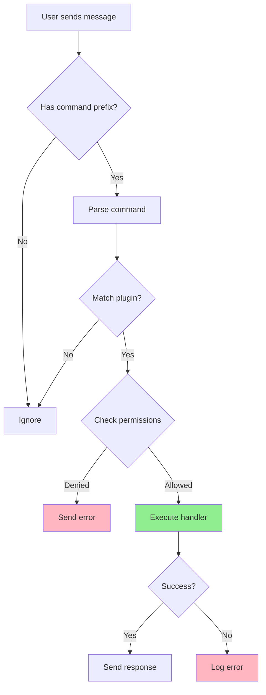
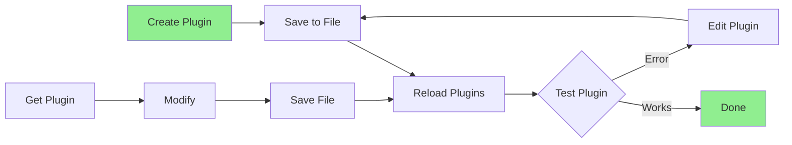
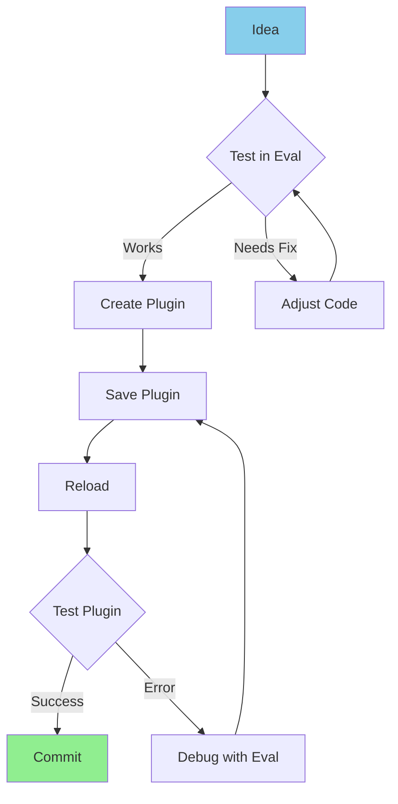

# 🔌 Liora Plugin Development Guide

Complete guide for creating and managing plugins in Liora bot framework.

---

## 📋 Table of Contents

- [Plugin Basics](#plugin-basics)
- [Plugin Management](#plugin-management)
- [Development Tools](#development-tools)
- [Best Practices](#best-practices)

---

## 🎯 Plugin Basics

### Plugin Structure

Plugins are organized in category-based folders under `/src/plugins/`:

```
src/plugins/
├── info/              # Information commands (ping, menu, etc.)
├── owner/             # Owner-only commands (eval, exec, etc.)
├── group/             # Group management commands
├── downloader/        # Media downloaders
├── ai/                # AI features
├── tool/              # Utility tools
└── [custom]/          # Your custom categories
```

### Basic Plugin Template

```javascript
/**
 * @file Command description
 * @module plugins/category/command-name
 * @license Apache-2.0
 * @author Your Name
 */

let handler = async (m, { sock, args, text }) => {
    // Your command logic here
    await sock.sendMessage(m.chat, {
        text: "Example response",
    });
};

// Command metadata
handler.help = ["commandname"];
handler.tags = ["category"];
handler.command = /^(commandname|alias)$/i;

// Optional properties
handler.owner = false; // Owner-only command
handler.premium = false; // Premium-only command
handler.group = false; // Group-only command
handler.admin = false; // Admin-only command
handler.botAdmin = false; // Bot must be admin

export default handler;
```

### Handler Parameters

```javascript
handler = async (
    m,
    {
        sock, // Connection object
        args, // Command arguments as array
        text, // Full text after command
        command, // Matched command name
        usedPrefix, // Prefix used (.!/)
        isOwner, // Is user owner?
        isAdmin, // Is user admin?
        isBotAdmin, // Is bot admin?
        groupMetadata, // Group info (if group chat)
        participants, // Group participants
    }
) => {
    // Your code here
};
```

### Plugin Workflow



### Simple Example: Ping Command

```javascript
/**
 * @file Ping command - measures bot latency
 * @module plugins/info/ping
 */

let handler = async (m, { sock }) => {
    const start = Bun.nanoseconds();
    const msg = await sock.sendMessage(m.chat, {
        text: "⏱️ Checking...",
    });
    const ns = Bun.nanoseconds() - start;
    const ms = (ns / 1_000_000).toFixed(0);

    await sock.sendMessage(m.chat, {
        text: `🏓 Pong! ${ms} ms`,
        edit: msg.key,
    });
};

handler.help = ["ping"];
handler.tags = ["info"];
handler.command = /^(ping)$/i;

export default handler;
```

### Advanced Example: Calculator

```javascript
/**
 * @file Calculator command
 * @module plugins/tool/calculator
 */

let handler = async (m, { sock, text }) => {
    if (!text) {
        return m.reply("Example usage: .calc 2 + 2");
    }

    try {
        // Safe evaluation (only math operations)
        const result = Function('"use strict"; return (' + text + ")")();

        await sock.sendMessage(m.chat, {
            text: `📊 Result: ${result}`,
        });
    } catch (error) {
        await m.reply("❌ Invalid expression");
    }
};

handler.help = ["calc", "calculate"];
handler.tags = ["tool"];
handler.command = /^(calc|calculate)$/i;

export default handler;
```

---

## 🛠️ Plugin Management

### Adding Plugins via Command

Use the `savefile` command to add new plugins dynamically:

#### Method 1: Upload File

```bash
# 1. Create plugin file locally
# 2. Send file to bot with caption:
.sf src/plugins/info/newcommand.js
```

#### Method 2: Inline Creation

```javascript
// Send this as eval command (owner only):
> await Bun.write('./src/plugins/info/newcmd.js', `
let handler = async (m, { sock }) => {
    await sock.sendMessage(m.chat, {
        text: 'Example new command!'
    });
};

handler.help = ['newcmd'];
handler.tags = ['info'];
handler.command = /^(newcmd)$/i;

export default handler;
`);
await global.reloadAllPlugins();
```

### Getting Plugin Files

Retrieve plugin source code:

```bash
# Get specific plugin
.gf src/plugins/info/ping.js

# This sends the file as a document
```

### Deleting Plugins

Remove unwanted plugins:

```bash
# Delete specific plugin
.df src/plugins/info/oldcommand.js

# Plugin is removed from disk
```

### Reloading Plugins

Apply changes without restarting:

```bash
# Reload all plugins
.reload
# or
.rl

# Plugins are re-imported and command handlers updated
```

### Plugin Management Workflow



---

## 🔧 Development Tools

### JavaScript Evaluation

Execute JavaScript code in real-time (owner only):

#### Expression Evaluation

```bash
# Returns the result value
=> 1 + 1
# Output: 2

=> m.chat
# Output: "123456789@s.whatsapp.net"

=> Object.keys(sock)
# Output: ["user", "sendMessage", "groupMetadata", ...]

=> global.plugins
# Output: { "info-ping.js": {...}, ... }
```

#### Statement Execution

```bash
# Executes code without returning value
> console.log('Example test')
# Output: Example test

> await sock.sendMessage(m.chat, { text: 'Example' })
# Sends message

> for (let i = 0; i < 3; i++) console.log(i)
# Output: 0 1 2
```

#### Advanced Examples

```bash
# Get all plugin names
=> Object.keys(global.plugins)

# Count total commands
=> Object.values(global.plugins).filter(p => p.help).length

# List all commands
=> Object.values(global.plugins)
    .filter(p => p.help)
    .flatMap(p => p.help)

# Test plugin execution
=> await global.plugins['info-ping.js'](m, { sock })

# Inspect message object
=> Bun.inspect(m, { depth: 2 })
```

### Shell Command Execution

Run system commands (owner only):

#### Basic Commands

```bash
# List directory
$ ls -la

# Check disk usage
$ df -h

# View running processes
$ ps aux | grep bun

# Check memory usage
$ free -h

# Network info
$ ip addr show
```

#### Advanced Flags

```bash
# Custom working directory
$ --cwd=/tmp ls -la

# With timeout (5 seconds)
$ --timeout=5000 npm install

# Verbose output
$ --verbose echo "Example test"

# Custom environment variable
$ --env=NODE_ENV=production node script.js

# Combined flags
$ --cwd=/tmp --timeout=3000 --verbose ls
```

#### Blocked Commands (Security)

These commands are blocked for safety:

- `rm -rf /` - System deletion
- `rm -rf *` - Mass deletion
- `mkfs.ext4` - Format filesystem
- `dd if=` - Disk operations
- `shutdown`, `reboot`, `poweroff` - System control
- Fork bombs: `:(){ :|: & };:`

#### Safe Examples

```bash
# Install package
$ npm install axios

# Git operations
$ git pull origin main

# File operations
$ cat .env

# Search files
$ find . -name "*.js" -type f

# Grep in files
$ grep -r "TODO" src/

# Node/Bun info
$ bun --version
$ node --version
```

### Development Workflow



---

## ✅ Best Practices

### 1. Plugin Organization

```javascript
/**
 * Always use comprehensive JSDoc
 * @file Brief description
 * @module plugins/category/name
 * @license Apache-2.0
 * @author Your Name
 */

// Group related functionality
const helpers = {
    formatData: (data) => {
        return data.toString().trim();
    },
    validateInput: (input) => {
        return input && input.length > 0;
    },
};

// Main handler
let handler = async (m, { sock, text }) => {
    if (!helpers.validateInput(text)) {
        return m.reply("Example: Input required");
    }

    const formatted = helpers.formatData(text);
    await sock.sendMessage(m.chat, {
        text: `Example: ${formatted}`,
    });
};

// Clear metadata
handler.help = ["command"];
handler.tags = ["category"];
handler.command = /^(command|alias)$/i;

export default handler;
```

### 2. Error Handling

```javascript
let handler = async (m, { sock, args }) => {
    try {
        // Validate input first
        if (!args[0]) {
            return m.reply("Example: Please provide required argument");
        }

        // Validate format
        if (!/^\d+$/.test(args[0])) {
            return m.reply("Example: Argument must be a number");
        }

        // Process command
        const result = await someAsyncOperation(args[0]);

        // Handle empty result
        if (!result) {
            return m.reply("Example: No results found");
        }

        // Send response
        await sock.sendMessage(m.chat, {
            text: `Example result: ${result}`,
        });
    } catch (error) {
        // Log error for debugging
        console.error("Example error in command:", error);

        // User-friendly error message
        await m.reply("Example: An error occurred. Please try again later.");
    }
};
```

### 3. Async Operations with Loading

```javascript
let handler = async (m, { sock, args }) => {
    // Send loading message
    const loadingMsg = await sock.sendMessage(m.chat, {
        text: "⏳ Example: Processing...",
    });

    try {
        // Perform async operation
        const data = await fetchSomeData(args[0]);

        // Edit loading message with result
        await sock.sendMessage(m.chat, {
            text: `✅ Example: ${data}`,
            edit: loadingMsg.key,
        });
    } catch (error) {
        // Edit with error message
        await sock.sendMessage(m.chat, {
            text: "❌ Example: Operation failed",
            edit: loadingMsg.key,
        });
    }
};
```

### 4. Resource Management

```javascript
import { readFile } from "node:fs/promises";

let handler = async (m, { sock }) => {
    try {
        // Read file efficiently
        const buffer = await readFile("./data/example.json");
        const data = JSON.parse(buffer.toString());

        // Process data
        const result = processData(data);

        // Send response
        await sock.sendMessage(m.chat, {
            text: `Example: ${result}`,
        });
    } catch (error) {
        if (error.code === "ENOENT") {
            await m.reply("Example: File not found");
        } else {
            console.error("Example error:", error);
            await m.reply("Example: Failed to process data");
        }
    }
};
```

### 5. Permission Checks

```javascript
let handler = async (m, { sock, isAdmin, isBotAdmin }) => {
    // Check if user is admin
    if (!isAdmin) {
        return m.reply("Example: This command requires admin privileges");
    }

    // Check if bot is admin (for group operations)
    if (!isBotAdmin) {
        return m.reply("Example: Bot must be admin to use this command");
    }

    // Your command logic here
    await sock.sendMessage(m.chat, {
        text: "Example: Command executed",
    });
};

handler.help = ["admincmd"];
handler.tags = ["group"];
handler.command = /^(admincmd)$/i;
handler.group = true; // Group only
handler.admin = true; // Admin only
handler.botAdmin = true; // Bot must be admin

export default handler;
```

### 6. Input Validation

```javascript
let handler = async (m, { sock, text, args }) => {
    // Check if text provided
    if (!text) {
        return m.reply(`Example usage: .command <input>`);
    }

    // Validate format (e.g., URL)
    const urlRegex = /^https?:\/\/.+/i;
    if (!urlRegex.test(text)) {
        return m.reply("Example: Please provide a valid URL");
    }

    // Validate length
    if (text.length > 1000) {
        return m.reply("Example: Input too long (max 1000 characters)");
    }

    // Sanitize input
    const sanitized = text.trim().toLowerCase();

    // Process
    await sock.sendMessage(m.chat, {
        text: `Example: Processing ${sanitized}`,
    });
};
```

### 7. Testing Plugins

```bash
# Test basic functionality
.command test

# Test with various inputs
.command
.command arg1
.command arg1 arg2
.command "quoted text"

# Test error handling
.command invalid@input

# Test in different contexts
# - Private chat
# - Group chat (as admin)
# - Group chat (as member)

# Monitor logs
$ tail -f logs/bot.log
```

---

## 📞 Need Help?

- **WhatsApp Group**: [Join Community](https://chat.whatsapp.com/FtMSX1EsGHTJeynu8QmjpG)
- **GitHub Issues**: [Report Bug](https://github.com/naruyaizumi/liora/issues)
